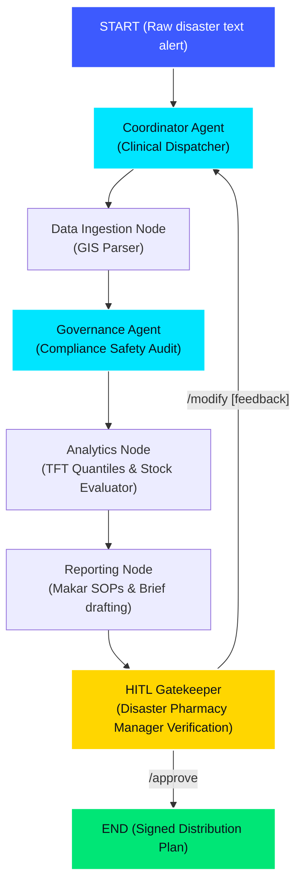

# REMEDI (Resilient Medication Management for Disasters)

[](https://www.kaggle.com/competitions/5-day-ai-agents-intensive-vibecoding-course-with-google/overview)
[](https://opensource.org/licenses/Apache-2.0)
[](https://www.python.org/)
[](https://fastapi.tiangolo.com/)
[](https://remedi-ekun.onrender.com)

**REMEDI** is a multi-agent pharmacy intelligence system built to manage chronic cardiovascular medication utilization surges during tropical flood disasters. Developed as a Capstone Project for **Kaggle's 5-Day AI Agents: Intensive Vibe Coding Course with Google**, it automates disaster ingestion, calculates multi-quantile demand surges, audits distribution plans using a multi-format local RAG policy database, and implements a strict human-in-the-loop (HITL) manager sign-off protocol.

---

## 🎯 Problem Statement

During natural disasters (e.g., tropical monsoon floods), public healthcare facilities face sudden, unpredictable surges in chronic medication demand (such as cardiovascular drugs) due to displacement, lost prescriptions, and stress-induced exacerbations.

Suboptimal resource planning leads to:

1. **Critical stockouts** at heavily affected facilities.
2. **Resource wastage** due to blind over-procurement from central depots.
3. **Compliance breaches** by sending excessive supplies without administrative sign-off.

---

## 💡 The REMEDI Solution

REMEDI coordinates a **Hierarchical Multi-Agent Graph** that processes raw disaster alerts, evaluates regional baselines, forecasts demand, allocates resources, and requires a Disaster Pharmacy Manager signature before executing allocations:

1. **Intelligent Ingestion & Catchment Validation**: Validates if incoming alerts affect the target facility's catchment area. External warnings (e.g. other districs) are flagged with zero emergency surge impact, preventing false alarms.
2. **Workflow Safety Inversion**: Runs the compliance safety check **before** clinical forecasting and math calculations, preventing PII or sensitive demographic data from being parsed to down-stream agents.
3. **Temporal Fusion Transformer (TFT) Multi-Quantile Forecasting**: Simulates a TFT deep learning model to forecast demand curves across three bounds:
   - **p10 (Conservative)**
   - **p50 (Expected)**
   - **p90 (Extreme Surge)**
4. **Bidirectional Stock Relocation (Lending/Borrowing)**:
   - **Borrow flow**: If HKM has a stock deficit, it borrows excess capacity from partner facility **Hospital Kampung Pisang (HKP)**.
   - **Lend flow**: If HKM has a surplus and HKP is in deficit, HKM automatically lends its excess stock to HKP.
   - MDHO (Makar District Health Office) acts as the central administrative supply hub to procure any remaining deficit.
5. **Multi-Format Local RAG Guidelines Compliance**: Audits the distribution draft using keyword search retrieval against a folder (`remedi/rag_docs/`) supporting markdown, text, and PDF files.
6. **Interactive Glassmorphic Dashboard**: Visually displays the logistics route on an interactive Leaflet.js map (drawing relocations and procurement lines) and renders grouped bar charts of TFT quantiles via Chart.js.

---

## 🏥 Makar District Health Network

REMEDI operates at the district level to coordinate distribution and logistics across key healthcare facilities in the fictional **Makar District**:

* **Makar District Health Office (MDHO)**: The central administrative coordinator and logistics depot. It acts as the primary procurement source for the district, verifying safety stock guidelines and processing emergency purchase requests.
* **Hospital Kuala Makar (HKM)**: The main district hospital serving a catchment population of approximately 220,000. Located in a high-risk flood zone, it is highly vulnerable to medication stockouts during natural disasters.
* **Hospital Kampung Pisang (HKP)**: A secondary partner facility in the district network serving approximately 180,000 residents. It partners with HKM for peer-to-peer stock relocation (lending/borrowing) before relying on central DHO procurement.

---

## 🏗️ System Architecture

The agent interactions and execution pipeline are defined using the **ADK 2.0 Graph Workflow API**:



### Mathematical Formulation

The demand surge factor is computed using:

$$
\text{Surge Factor} = 1.0 + (\text{Severity} \times \text{Vulnerability} \times 0.5)
$$

Where:

* **p10 surge bounds multiplier**: $0.2 \times (\text{Surge Factor} - 1.0)$
* **p50 expected multiplier**: $0.5 \times (\text{Surge Factor} - 1.0)$
* **p90 extreme surge multiplier**: $0.8 \times (\text{Surge Factor} - 1.0)$

---

## 📂 Key File Components

* **[app/tools.py](file:///home/radziaziz/Projects/5DGAI/remedi/app/tools.py)**: Forecasting, bidirectional stock allocation, and multi-format directory RAG guidelines retrieval functions.
* **[app/agent.py](file:///home/radziaziz/Projects/5DGAI/remedi/app/agent.py)**: Node logic, agent schemas, conditional transitions, and callback definitions.
* **[run_remedi.py](file:///home/radziaziz/Projects/5DGAI/remedi/run_remedi.py)**: Terminal-based CLI supporting manager approvals and modification commands (with typo corrections).
* **[app/fast_api_app.py](file:///home/radziaziz/Projects/5DGAI/remedi/app/fast_api_app.py)**: Server mapping REST API routes and static frontend directories.
* **[frontend/index.html](file:///home/radziaziz/Projects/5DGAI/remedi/frontend/index.html)** & **[index.js](file:///home/radziaziz/Projects/5DGAI/remedi/frontend/index.js)**: The interactive dark-mode dashboard showing routing on a Leaflet map and Chart.js quantiles.
* **[rag_docs/pkd_makar_disaster_guidelines.md](file:///home/radziaziz/Projects/5DGAI/remedi/rag_docs/pkd_makar_disaster_guidelines.md)**: Standard SOP document for safety stocks and relocation thresholds under the Makar District Health Office (MDHO).

---

## ⚙️ Installation & Local Setup

Ensure you have Python 3.13 and `uv` installed.

### 1. Clone the repository and navigate to the project directory:

```bash
cd remedi
```

### 2. Configure Environment Variables:

Create a `.env` file in the root of the project:

```bash
GEMINI_API_KEY=your_gemini_api_key_here
```

### 3. Install Dependencies:

```bash
uv sync
```

---

## 🚀 Running the Application

### Option A: Live Hosted Web Dashboard (Recommended)

Access the running dashboard instantly online (no installation or setup required):
* **URL**: [https://remedi-ekun.onrender.com](https://remedi-ekun.onrender.com)
* **Action**: Enter a disaster warning (e.g. *"Major flooding is expected to hit Makar District next week."*) and click **Analyze Alert & Run Forecast**.

### Option B: Local Web Dashboard

If you prefer to run the web dashboard locally on your machine:
1. Start the local FastAPI server:
   ```bash
   uv run python app/fast_api_app.py
   ```
2. Open your browser and navigate to:
   ```
   http://localhost:8000
   ```
3. Enter a disaster warning and run the analysis.

### Option C: Local Terminal-based CLI Client

Run the interactive prompt directly in your shell:
1. Launch the CLI client:
   ```bash
   uv run python run_remedi.py
   ```
2. Analyze alerts, review generated reports in the terminal, and submit `/approve` or `/modify [adjustments]` commands directly.

---

## 🧪 Testing and Verification

A comprehensive test suite validates both the underlying math models and the multi-agent graph execution pipeline:

### 1. Run Unit Tests (Math, RAG, and Tool validations)

```bash
uv run pytest tests/unit/
```

*Validates: TFT quantile bounds ($p10 \le p50 \le p90$), bidirectional relocation lending/borrowing, baseline GIS lookups, and multi-format folder RAG queries.*

### 2. Run Integration Tests (Complete HITL loop validation)

Ensure the FastAPI app is running in the background, then run:

```bash
uv run pytest tests/integration/test_flow.py
```

*Validates: Ingestion, parameter updates using `/modify`, and successful `/approve` signatures.*
